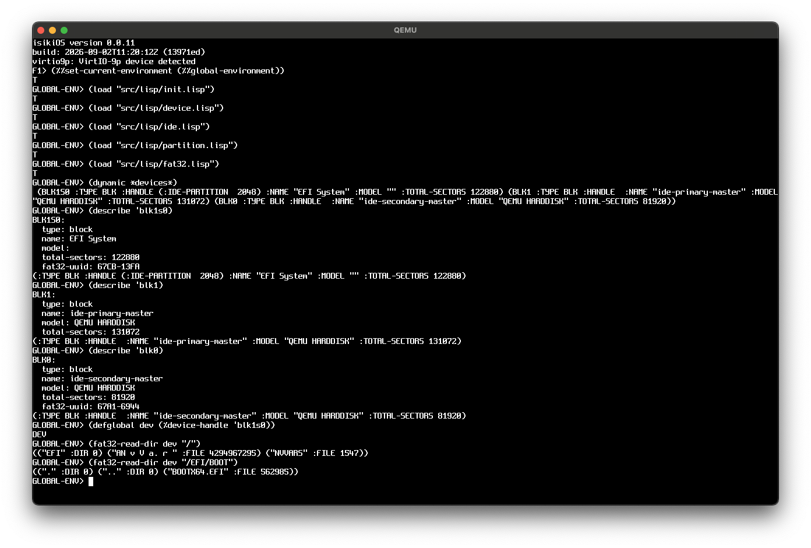
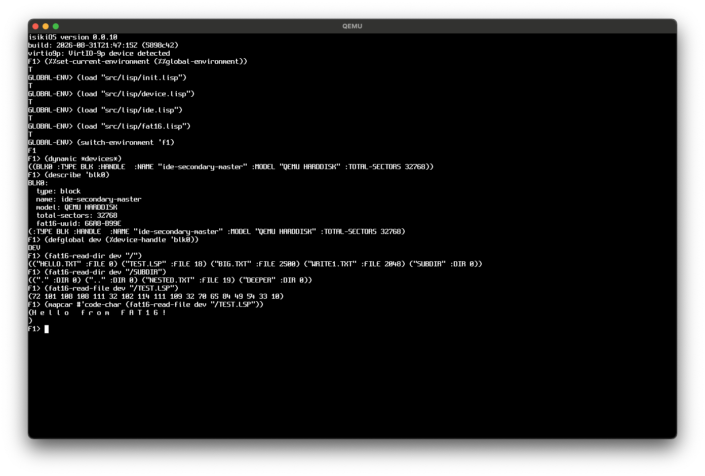
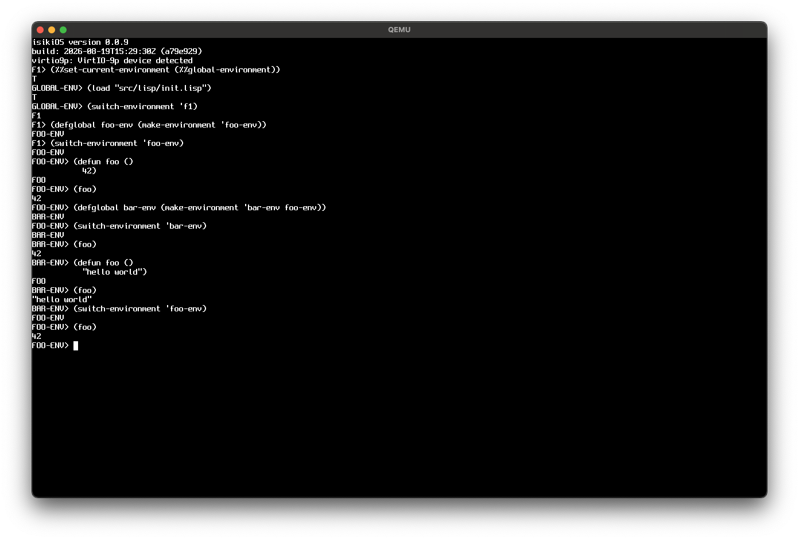
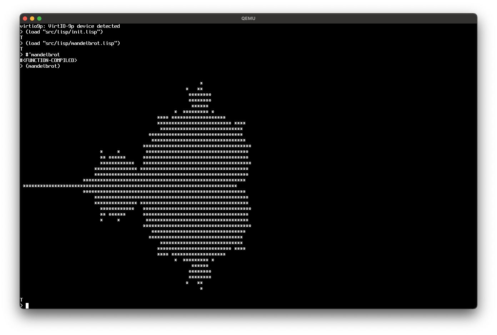
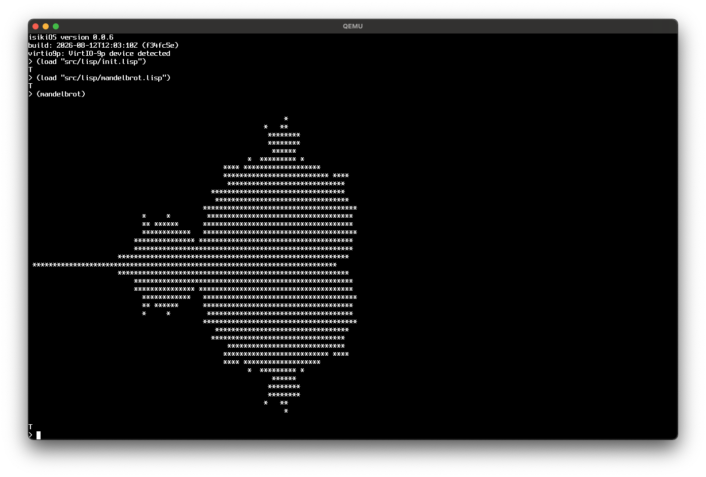
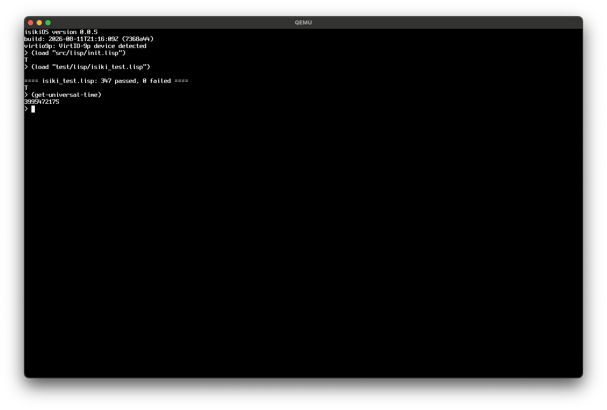
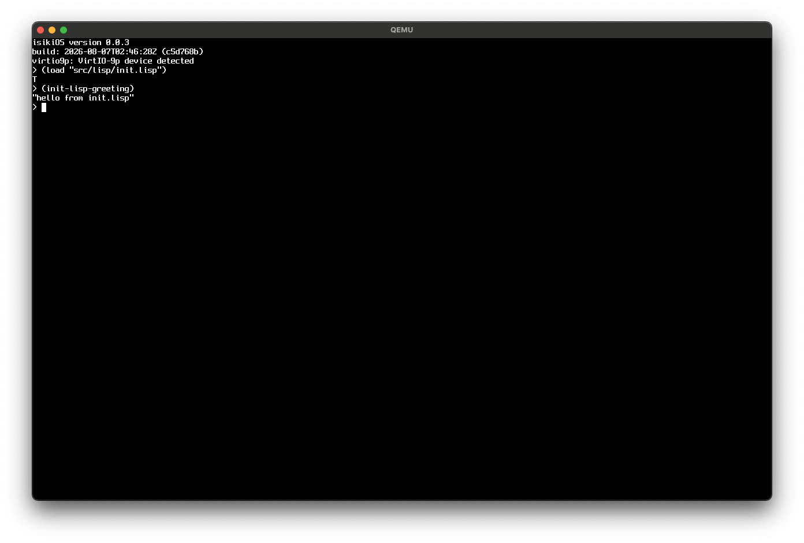
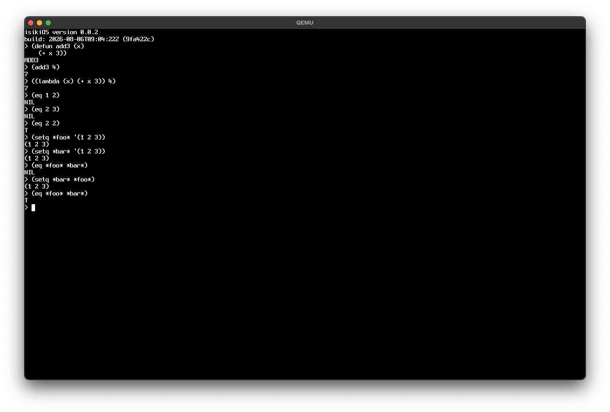
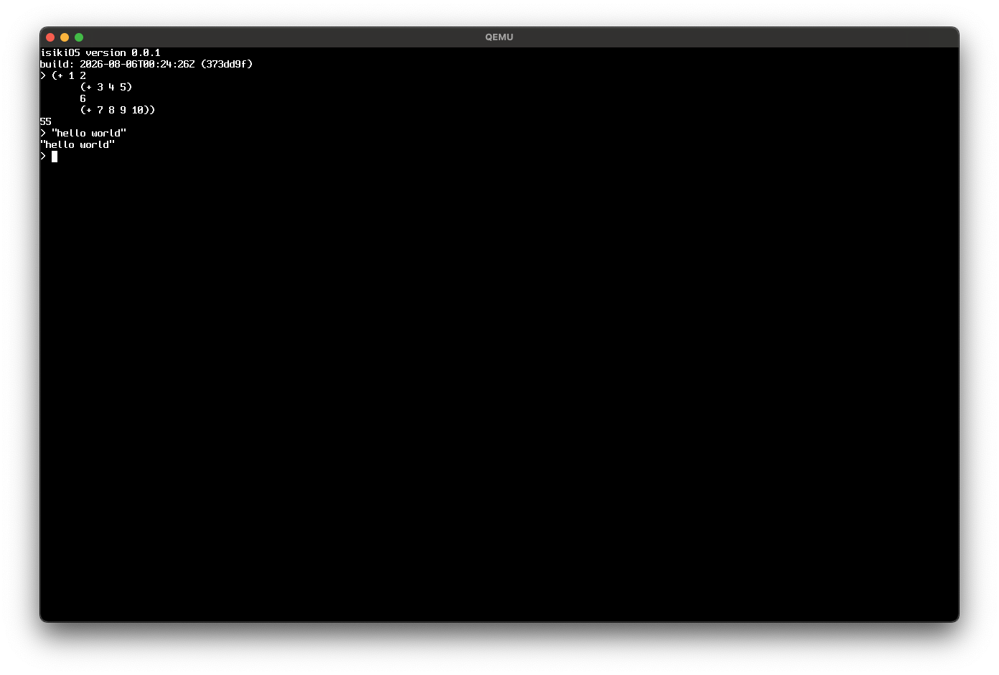
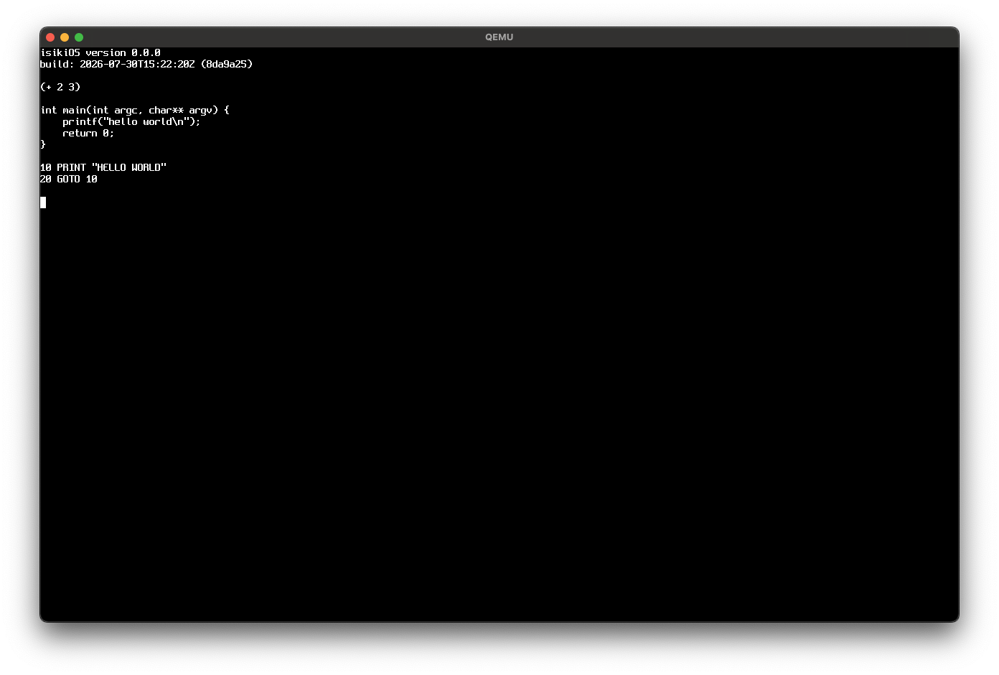

# isiki (ISLisp-based Bare-metal OS)

`isiki`（イシキ）は、x86-64アーキテクチャ上で動作する、ISLispベースのベアメタル・Lispオペレーティングシステム（LispOS）です。


## Require

- docker
- QEMU
- OVMF

## Usage

QEMUとOVMFをインストール後、 `make build` でイメージを作成し、 `make run` で起動します。
起動しない場合は正しい OVMF のパスを指定してください。

```
make build && make run
```

起動後、 REPL が立ち上がるので以下のコマンドで ISLisp 環境を構築します。

```lisp
(%%set-current-environment (%%global-environment))
;; global-environment に ISLisp を読み込ませる
(load "src/lisp/init.lisp")

;; F1 のプロセスで実行していた場合は環境を F1 に戻します
(switch-environment 'f1)
```

9Pプロトコルにより、QEMU内からホストのファイルにアクセスすることができます。

F1, F2, F3, F4 を押すことでプロセスを切り替えることができます。


## Features

#### ISLisp全般

[ISLisp-WorkingDraft-v23](http://islisp.org/docs/islisp-v23.pdf) に記載の機能はほぼ実装しています。
[isiki_test.lisp](test/lisp/isiki_test.lisp) で、仕様書に記載している内容をテストしています。

#### 環境

ISLisp には Common Lisp のような動的な package システムがなく、module は完成したコードをカプセル化してロードすることを主な前提としています。isikiOS では ISLisp の module 構造を尊重しつつ、REPL 上でコードを動的に書き換えながら進めるインクリメンタルな開発スタイルを実現するため、これとは別に「環境（environment）」という独自のファーストクラスな仕組みを導入しています。


- **環境の構造:** 各環境は `variables` ・ `functions` ・ `parent` の3スロットを持ち、ルートとなる `global-environment` を頂点とする木構造をなします。
- **書き込みは常に現在の環境のみ:** `defparameter` や `defun` は、実行時の現在の環境（current environment）にのみ束縛を書き込みます。親環境の束縛が書き換わることはありません。
- **読み込みは親を辿るシャドウイング:** symbol はグローバルに1つだけinternされているため、どの環境から見ても同じsymbolを指します。親環境で使われているシンボルと同じシンボルを現在の環境に登録すると、参照時には現在の環境から親へと辿るため、親側の定義は隠され（shadow）自由に上書きできます。ISLisp本来は組み込み関数の再定義やシャドウイングを制限していますが、isikiOSでは明示的にこれを許可しています。
- **他環境への直接アクセス:** symbolは全環境で共有されているため、現在の環境ではなく親環境や別の環境を明示的に指定して、その環境の変数・関数を直接参照・上書きすることもできます(実装予定・未実装)。

これにより、専用の環境を作って自由に「汚し」ながら試行錯誤し、固まった変更だけを親環境（`global-environment` など）へ反映させる、といった開発フローが可能になります。


```lisp
;; foo-env という名前で環境を作成し、 foo-env という symbol にセット
;; 親環境は未指定なので global-environment が自動的にセットされる
(defglobal foo-env (make-environment 'foo-env))

;; foo-env に環境をスイッチ
(switch-environment 'foo-env)

;; foo-env 環境に関数を定義
(defun foo ()
  42)

(foo)
-> 42


;; foo-env を親環境として別の bar-env 環境を作成する
(defglobal bar-env (make-environment 'bar-env foo-env))

;; bar-env にスイッチ
(switch-environment 'bar-env)

;; 親である foo-env 環境にあった関数を実行することができる
(foo)
-> 42

;; 親の環境と同じ名前の関数を bar-env 環境で作成することができる
(defun foo ()
  "hello world")

(foo)
-> "hello world"

;; foo-env にスイッチし、 foo を実行すると foo-env で定義した内容になっている
(swtich-environment 'foo-env)
(foo)
-> 42
```


#### シングルアドレス空間 ＆ 言語による隔離 (SASOS)

**現在は未実装**

ハードウェア（MMU）による強制的なプロセス隔離を行いません。カーネルもドライバもアプリケーションも、システム全体がひとつの広大なフラットメモリ空間を共有します。
メモリの安全性とコードの隔離は、ハードウェアではなく「環境（environment）」という言語レベルの仕組み（言語の壁）のみによって優雅に統治されます。アドレス空間の分離というオーバーヘッドを排除した、究極にフラットで高速な実行環境を実現します。
- **他プロセスの状態への直接介入:** MMUによる保護が無いため、他プロセスのPC・スタックフレーム・レジスタといった実行状態そのものを、他プロセスから直接参照・変更することも可能です。


## アーキテクチャとレイヤー命名規則

`isiki` では、C言語/アセンブリの最下層からユーザー空間まで、アクセスの深さに応じて明確なプレフィックス命名規則（subprimitive）を設けています。

### Subprimitive（Lisp側記法）
- **`%%` (ハードウェア層):**
  - CPU命令やI/Oポート、レジスタの直接操作。
  - LispObjectのタグや型を一切無視した生データ（Fixnumなら `<< 3` された値、Consならアドレスに `TAG_CONS` をORした値）。
- **`%` (OS・カーネル層):**
  - GC、メモリ管理、デバイスドライバの内部ロジック。
  - タグは削られているが、ポインタや整数として意味が整えられた値（Fixnumならそのままの整数、Consなら生のcarアドレス）。
- **(プレフィックスなし) (ユーザ・システム層):**
  - アプリケーション、REPL、OS標準API。
  - すべてがLispのタグ付きオブジェクトとして完全隠蔽された世界。

### C言語 / アセンブリ層の命名規則
- **`sys_`**: システムコール相当の処理（Lisp/C境界）
- **`os_`**: OSカーネル内部処理
- **`cc_`**: C言語で直接実装されたLisp組み込み関数（例: `cc_car`, `cc_assoc_eq`）
- **`c_`**: アセンブリ割り込みハンドラ（`asm_`）から呼び出されるC言語側ハンドラ（例: `c_keyboard_handler`）

### コード例: キーボード入力処理の流れ

```lisp
;; [ユーザー・システム層] 普通のアプリケーションが呼ぶ安全な関数
(defun read-char-from-keyboard ()
  (let ((key-event (sys-pop-keyboard-buffer))) ; 安全なLispオブジェクト（構造体など）が返る
    (if (eq (keyboard-event-type key-event) :press)
        (keyboard-event-char key-event)
        nil)))

;; [OS・カーネル層] タイマー割り込みやドライバが裏で回す低レイヤー関数
(defun %handle-keyboard-interrupt ()
  (let ((status (%%in-8 #x64))) ; ★%%でハードウェアの生ステータスを見る
    (when (logbitp 0 status)
      (let ((raw-code (%%in-8 #x60))) ; ★%%で生のスキャンコードを引っこ抜く
        (let ((ascii-code (%parse-scancode raw-code))) ; ★%でLispが読める整数/シンボルに整える
          (%push-to-keyboard-buffer ascii-code))))))
```


## 動作要件
- **アーキテクチャ:** x86-64 (ベアメタル / QEMU)
- **ターゲット言語:** ISLisp
- **ユーザーモデル:** シングルユーザー・マルチプロセス


## 名前の由来
- **IS**: 言語のルーツである ISLisp の「IS」
- **式 (siki)**: Lispの本質である「S式」
- 無機質なハードウェアという肉体にLispの魂が宿り、システムが「意識 (isiki)」を持って自律駆動するLispOSである様を表しています。


## ライセンス
[MIT License](LICENSE)

## Third Party License

### Spleen Font
Spleen is released under the BSD 2-Clause license.
Copyright (c) 2018-2026, Frederic Cambus

see [LICENSE](./assets/fonts/LICENSE)

## screen shot

version 0.0.11


version 0.0.10


version 0.0.9



version 0.0.8

なし

version 0.0.7



version 0.0.6



version 0.0.5



version 0.0.4



version 0.0.3


version 0.0.2



version 0.0.1




version 0.0.0




[インタプリタとコンパイラの速度の比較(YouTube)](https://www.youtube.com/watch?v=NaNsI1Ex_CE)

