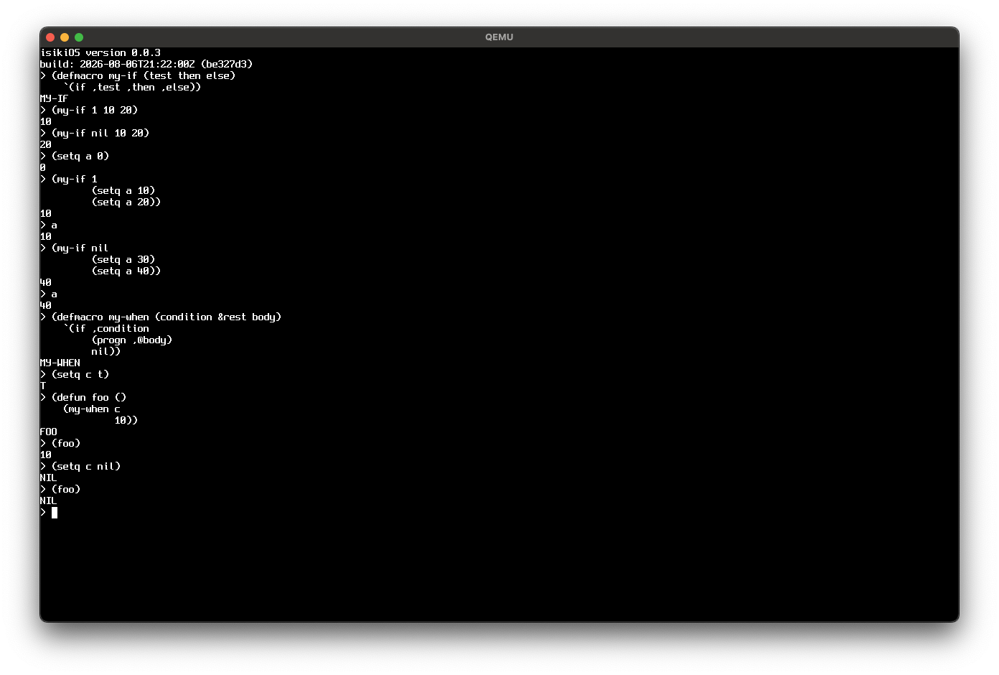

# isiki (ISLisp-based Bare-metal OS)

`isiki`（イシキ）は、x86-64アーキテクチャ上で動作する、ISLispベースのベアメタル・Lispオペレーティングシステム（LispOS）です。

UEFIからブートした直後の真っ暗なベアメタル空間にLispランタイムを立ち上げ、プログラマがREPLを通じてハードウェアのすべてを直接、かつ動的に掌握できる環境を提供します。

## 特徴

### 1. すべてを Lisp で扱うことができる
本OSにおいて、C言語はブートとランタイムの基礎（肉体）を構成するためだけに存在し、起動後の制御権はすべてLisp（意識）へと移譲されます。
- **C言語関数の直接呼び出し:** ブートストラップ層や低レイヤーで定義されたC言語の関数を、Lisp側から透過的に呼び出すことができます。
- **Lispからの直接I/O・ハードウェア制御:** `%%`（ダブルパーセント）および `%`（シングルパーセント）という、isikiOS独自のレイヤー記法（詳細は後述の「命名規則」を参照）を用いることで、アセンブリやC言語を介することなく、Lispから直接I/Oポートや周辺機器の制御が行えます。
- **生メモリ・タグデータの直接操作:** Lispオブジェクトの型を識別するための「タグ」で構成された生の物理メモリ構造を、Lispから直接参照・編集（ハック）することが可能です。ポインタの操作からランタイム構造の書き換えまで、すべてがLispで表現できます。

### 2. シングルアドレス空間 ＆ 言語による隔離 (SASOS)
ハードウェア（MMU）による強制的なプロセス隔離を行いません。カーネルもドライバもアプリケーションも、システム全体がひとつの広大なフラットメモリ空間を共有します。
メモリの安全性とコードの隔離は、ハードウェアではなく「環境（environment）」という言語レベルの仕組み（言語の壁）のみによって優雅に統治されます。アドレス空間の分離というオーバーヘッドを排除した、究極にフラットで高速な実行環境を実現します。
- **他プロセスの状態への直接介入:** MMUによる保護が無いため、他プロセスのPC・スタックフレーム・レジスタといった実行状態そのものを、他プロセスから直接参照・変更することも可能です。

### 3. 環境（environment）によるインクリメンタルな開発とシャドウイング
ISLisp には Common Lisp のような動的な package システムがなく、module は完成したコードをカプセル化してロードすることを主な前提としています。isikiOS では ISLisp の module 構造を尊重しつつ、REPL 上でコードを動的に書き換えながら進めるインクリメンタルな開発スタイルを実現するため、これとは別に「環境（environment）」という独自のファーストクラスな仕組みを導入しています。

- **環境の構造:** 各環境は `variables` ・ `functions` ・ `parent` の3スロットを持ち、ルートとなる `global-environment` を頂点とする木構造をなします。
- **書き込みは常に現在の環境のみ:** `defparameter` や `defun` は、実行時の現在の環境（current environment）にのみ束縛を書き込みます。親環境の束縛が書き換わることはありません。
- **読み込みは親を辿るシャドウイング:** symbol はグローバルに1つだけinternされているため、どの環境から見ても同じsymbolを指します。親環境で使われているシンボルと同じシンボルを現在の環境に登録すると、参照時には現在の環境から親へと辿るため、親側の定義は隠され（shadow）自由に上書きできます。ISLisp本来は組み込み関数の再定義やシャドウイングを制限していますが、isikiOSでは明示的にこれを許可しています。
- **他環境への直接アクセス:** symbolは全環境で共有されているため、現在の環境ではなく親環境や別の環境を明示的に指定して、その環境の変数・関数を直接参照・上書きすることもできます。

これにより、専用の環境を作って自由に「汚し」ながら試行錯誤し、固まった変更だけを親環境（`global-environment` など）へ反映させる、といった開発フローが可能になります。

### 4. REPL駆動のライブシステム開発
ベアメタル上で起動したREPL（対話環境）そのものがOSの操作インターフェースであり、開発環境です。グラフィックスコンソール（GOP）を通じてS式を入力し、動作しているOSのコードやメモリ空間をリアルタイムに再定義・拡張していくことができます。


## アーキテクチャとレイヤー命名規則

`isiki` では、C言語/アセンブリの最下層からユーザー空間まで、アクセスの深さに応じて明確なプレフィックス命名規則（subprimitive）を設けています。

### Subprimitive（Lisp側記法）
- **`%%` (ハードウェア層):**
  - CPU命令やI/Oポート、レジスタの直接操作。
  - LispObjectのタグや型を一切無視した生データ（Fixnumなら `<< 3` された値、Consならアドレスに `TAG_CONS` をORした値）。
- **`%` (OS・カーネル層):**
  - GC、メモリ管理、デバイスドライバの内部ロジック。
  - タグは削られているが、ポインタや整数として意味が整えられた値（Fixnumならそのままの整数、Consなら生のcarアドレス）。
- **(プレフィックスなし) (ユーザ・システム層):**
  - アプリケーション、REPL、OS標準API。
  - すべてがLispのタグ付きオブジェクトとして完全隠蔽された世界。

### C言語 / アセンブリ層の命名規則
- **`sys_`**: システムコール相当の処理（Lisp/C境界）
- **`os_`**: OSカーネル内部処理
- **`cc_`**: C言語で直接実装されたLisp組み込み関数（例: `cc_car`, `cc_assoc_eq`）
- **`c_`**: アセンブリ割り込みハンドラ（`asm_`）から呼び出されるC言語側ハンドラ（例: `c_keyboard_handler`）

### コード例: キーボード入力処理の流れ

```lisp
;; [ユーザー・システム層] 普通のアプリケーションが呼ぶ安全な関数
(defun read-char-from-keyboard ()
  (let ((key-event (sys-pop-keyboard-buffer))) ; 安全なLispオブジェクト（構造体など）が返る
    (if (eq (keyboard-event-type key-event) :press)
        (keyboard-event-char key-event)
        nil)))

;; [OS・カーネル層] タイマー割り込みやドライバが裏で回す低レイヤー関数
(defun %handle-keyboard-interrupt ()
  (let ((status (%%in-8 #x64))) ; ★%%でハードウェアの生ステータスを見る
    (when (logbitp 0 status)
      (let ((raw-code (%%in-8 #x60))) ; ★%%で生のスキャンコードを引っこ抜く
        (let ((ascii-code (%parse-scancode raw-code))) ; ★%でLispが読める整数/シンボルに整える
          (%push-to-keyboard-buffer ascii-code))))))
```


## 動作要件
- **アーキテクチャ:** x86-64 (ベアメタル / QEMU)
- **ターゲット言語:** ISLisp
- **ユーザーモデル:** シングルユーザー・マルチプロセス

## 開発のロードマップ
- [x] UEFIブートおよびGOP（Graphics Output Protocol）によるコンソール出力の確立
- [ ] `%%` レイヤー（物理I/O、生ポインタ・タグメモリ制御）の実装
- [ ] ISLisp準拠のコアランタイム・GCの移植
- [ ] ベアメタル上でのREPLの起動および自己ブートストラップ環境の構築


## 名前の由来
- **IS**: 言語のルーツである ISLisp の「IS」
- **式 (siki)**: Lispの本質である「S式」
- 無機質なハードウェアという肉体にLispの魂が宿り、システムが「意識 (isiki)」を持って自律駆動するLispOSである様を表しています。


## ライセンス
[MIT License](LICENSE)

## Third Party License

### Spleen Font
Spleen is released under the BSD 2-Clause license.
Copyright (c) 2018-2026, Frederic Cambus

see [LICENSE](./assets/fonts/LICENSE)

## 開発状況

- UEFIを使ったhello world
- キー入力結果を画面に表示(GOP)
- 複数の仮想バッファを切り替えて使用可能(F1〜F4)
- REPL から + 演算が可能
- 以下のprimitiveなオペレータを実装
  - `quote`
  - `if`
  - `progn`
  - `setq`
  - `defun`
  - `lambda`
  - `cons`
  - `car`
  - `cdr`
  - `eq`
  - `null`
  - `%%in-8`
  - `%%out-8`
  - `%%peek`
  - `%%poke`
- MACROが可能



